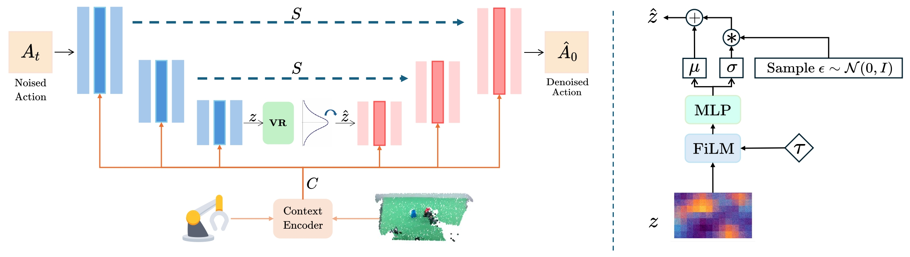

<h1 style="text-align:center; margin:0;">
  Information Filtering via Variational Regularization for Robot Manipulation
</h1>


<div align="center">


[](https://arxiv.org/abs/2601.21926)
[](LICENSE)
</div>

---


## 📋 Overview
<p align="center">
  
  <br>
  <em>Variational Regularization Module</em>
</p>

**Our proposed method, Variational Regularization (VR), adaptively filters out noise and redundant information from features**. *left*: Our method, built on DP3, introduces a Variational Regularization module immediately after the last downsampling features in the U-Net decoder, where noise is most likely to accumulate, enabling effective information filtering. *right* Architecture of the Variational Regularization module: it modulates the features conditioned on the diffusion timestep, then predicts the feature-wise mean and standard deviation, and uses the reparameterization trick to obtain the filtered features.


## ⚙️ Installation

Our code is intended to be evaluated with the third-party benchmark [RoboTwin2.0](https://github.com/RoboTwin-Platform/RoboTwin). To reproduce results, you need to **copy** our policy folder into the RoboTwin repository and run RoboTwin’s training and evaluation scripts.

Clone our repository along with [RoboTwin](https://github.com/RoboTwin-Platform/RoboTwin):
```
git clone --recurse-submodules https://github.com/jhz1192/VR-DP3.git
```

Set up the runtime environment using the scripts provided by RoboTwin  official doc:

```
conda create -n vr_dp3 python=3.10 -y
conda activate vr_dp3
cd RoboTwin
bash script/_install.sh
pip install zarr==2.12.0 wandb ipdb gpustat dm_control omegaconf hydra-core==1.2.0 dill==0.3.5.1 einops==0.4.1 diffusers==0.11.1 numba==0.56.4 moviepy imageio av matplotlib termcolor
```
Note that PyTorch3D must be installed successfull. For more detailed installation instructions, please refer to the official [doc](https://robotwin-platform.github.io/doc/usage/robotwin-install.html).

Download assets:
```
bash script/_download_assets.sh
```

After setting up the environment, copy the `VRDP3` folder into RoboTwin’s `policy/` directory:
```
cd ..
cp -r VRDP3/ RoboTwin/policy/
```

Install VRDP3 by running:
```
cd RoboTwin/policy/VRDP3/3D-Diffusion-Policy
pip install -e .
cd ../../..
```

## 🚀 Usage
### Collect Data
We use the data collection scripts provided by [RoboTwin](https://robotwin-platform.github.io/doc/usage/collect-data.html):

```
bash collect_data.sh ${task_name} ${task_config} ${gpu_id}
# Example: bash collect_data.sh beat_block_hammer demo_clean 0
```
Note: Please set `datatype.pointcloud` to `true` in `task_config/demo_clean.yml`.

### Training and Evaluation

1. **Prepare Training Data:**
```
cd policy/PocketDP3
bash process_data.sh ${task_name} ${task_config} ${expert_data_num}
# Example: bash process_data.sh beat_block_hammer demo_clean 50
```

2. **Training VR-DP3 by:**
```
bash train.sh ${task_name} ${task_config} ${expert_data_num} ${seed} ${gpu_id}
# bash train.sh beat_block_hammer demo_clean 50 0 0
```

3. **Evaluate VR-DP3 by:**
```
bash eval.sh ${task_name} ${task_config} ${ckpt_setting} ${expert_data_num} ${seed} ${gpu_id}
# bash eval.sh beat_block_hammer demo_clean demo_clean 50 0 0
```

All training and evaluation follow the official DP3 scripts provided by RoboTwin. If you encounter any issues, please refer to the official [RoboTwin DP3 documentation](https://robotwin-platform.github.io/doc/usage/DP3.html).


💡**Tips:** If you need to modify KL-weight $\beta$, please edit it in `VRDP3/3D-Diffusion-Policy/diffusion_policy_3d/policy/dp3_vr.py`.


## 📈 Results

### Performance on RoboTwin 2.0 Benchmark

Evaluation on the **RoboTwin 2.0** benchmark.

| Task | DP3 | **DP3 + VR** | Improvement |
| :--- | :---: | :---: | :---: |
| Handover Block | 70.0% | **91.0%** | +21.0% |
| Move Can Pot | 70.0% | **90.0%** | +20.0% |
| Open Microwave | 61.0% | **88.0%** | +21.0% |
| Place Cans Plasticbox | 48.0% | **70.0%** | +22.0% |
| Stamp Seal | 18.0% | **36.0%** | +18.0% |
| ... | ... | ... | ... |
| **Average (49 tasks)** | 56.3% | **62.4%** | +6.1% |

## 🎓 Citation

If you find VR-DP3 useful for your research, please kindly cite our paper:

```bibtex
@misc{zhang2026informationfilteringvariationalregularization,
      title={Information Filtering via Variational Regularization for Robot Manipulation}, 
      author={Jinhao Zhang and Wenlong Xia and Yaojia Wang and Zhexuan Zhou and Huizhe Li and Yichen Lai and Haoming Song and Youmin Gong and Jie Me},
      year={2026},
      eprint={2601.21926},
      archivePrefix={arXiv},
      primaryClass={cs.RO},
      url={https://arxiv.org/abs/2601.21926}, 
}
```

## 📄 License

This project is licensed under the Apache License 2.0 - see the [LICENSE](LICENSE) file for details.

## 🌟 Acknowledgments
- [Robotwin](https://robotwin-platform.github.io/) for the simulation bechmark
- [DP3](https://robotwin-platform.github.io/) for the strong baseline work

## ✉️ Contact

If you have any questions, please contact us at:
- Email: jinhaozhang0705@gmail.com
- GitHub Issues: [Open an issue](https://github.com/jhz1192/VR-DP3/issues)